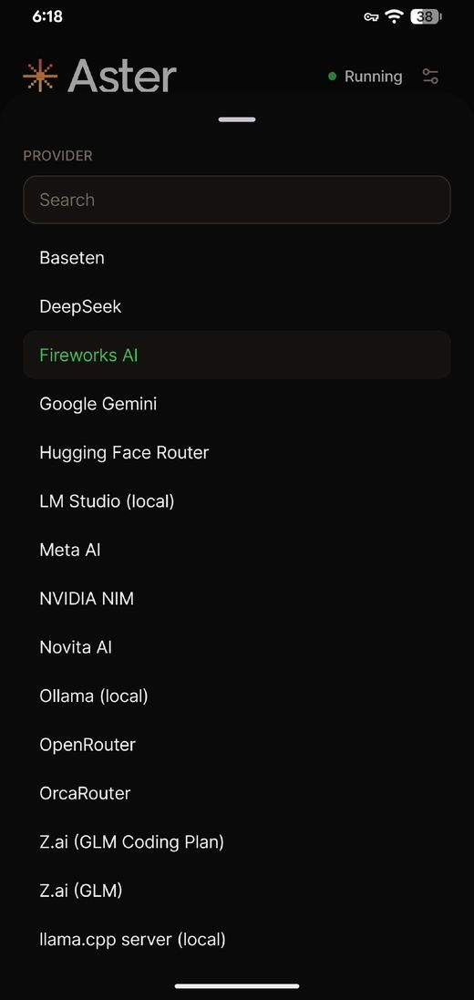
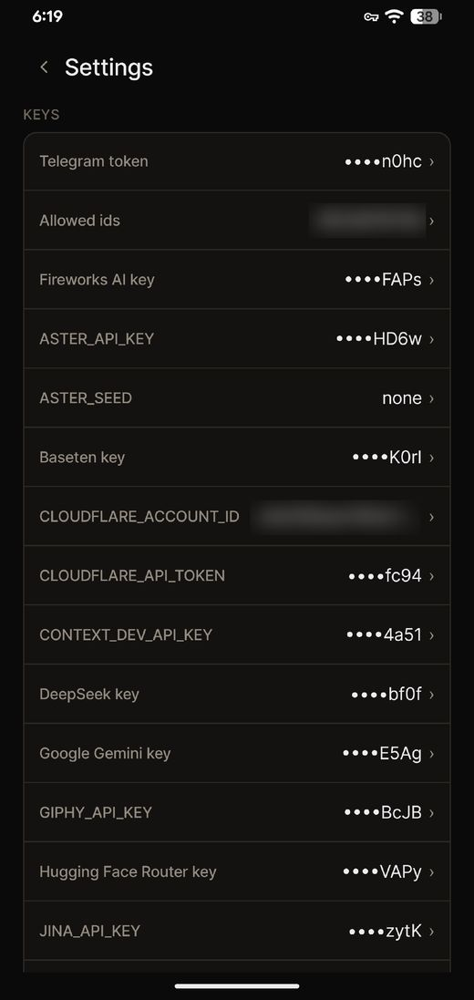
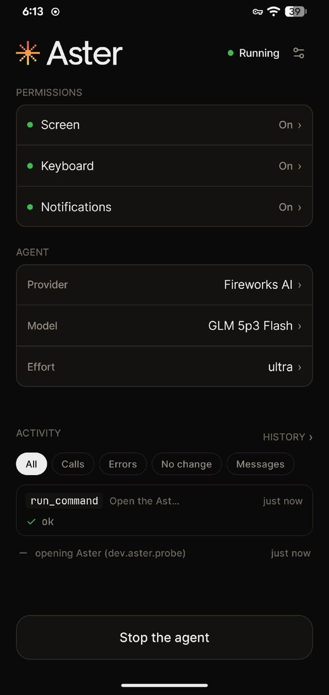
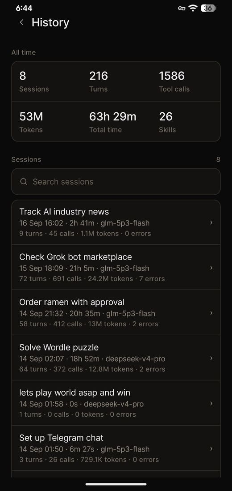
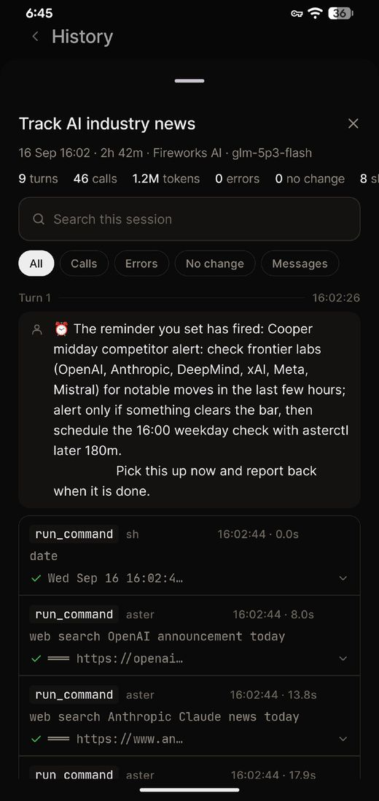

<div align="center">


# asterdroid

**Your phone. One conversation.**

Run the Aster agent on your Android. Send a message through Telegram,
and let it work through your apps for you.

[](https://github.com/Zfinix/asterdroid/releases)
[](https://www.android.com/)
[](https://github.com/Zfinix/asterdroid)

**[Website](https://droid.withaster.dev)** · [Releases](https://github.com/Zfinix/asterdroid/releases) · [Setup](docs/SETUP.md)


</div>

---

The app (`dev.aster.probe`) runs the full Aster agent on the phone. An accessibility service lets it read the screen, tap, swipe and type. You send instructions through Telegram and receive replies and screenshots.

`build-agent.sh` cross-compiles `aster-cli` for `aarch64-linux-android` and packages it as `libaster.so`. It uses the same tools, skills, prompts and review path as the terminal version.

**Status:** used as a daily driver, still experimental. Builds require an Aster checkout, support only `arm64-v8a`, and require broad device permissions.

## What it can do

### Your apps. A new way to use them.

The agent reads the screen, taps, swipes, and types. Just say what you want to do:

```txt
Open settings and turn on Do Not Disturb.
```

### It remembers, and it learns

Save a fact with `/remember`, teach it a routine with `/learn`, and browse the collection with `/skills`. Installed skills show up as `/commands` too.

```txt
/remember I prefer a quiet phone after 10 pm
Saved to memory. Prefers a quiet phone after 10 pm.

/learn
New skill: quiet-mode
Opens Settings, turns on Do Not Disturb, and lowers ring volume.
```

### It comes back on its own

The agent schedules its own wake-ups, ends the turn, and returns when the timer fires. Rider checks, chunked recordings, anything that needs a later look. Manage them from Telegram with `/checkins` and `/cron`.

### Watch it work. Take over whenever.

Use `/mirror` to open your phone's live screen in a browser, over your LAN or Tailscale. Tap, type, and control it yourself.

### Your choice of model

Connect a cloud provider or a local model server, and change the model and reasoning effort from chat. 40 providers with key pages in [docs/PROVIDERS.md](docs/PROVIDERS.md); Groq has a free tier, a local server needs no key.

<div align="center">

<table>
  <tr>
    <td></td>
    <td></td>
  </tr>
</table>

</div>

### The little things, thought through

- **Pick up a conversation**: list past sessions, resume your work, or start fresh
- **Stop or try again**: cancel a running turn, retry the last message, see the queue
- **See what happened**: agent status, tool activity, and transcripts in the app
- **Choose who can ask**: set Allowed ids to your Telegram user id; the bot ignores everyone else

<div align="center">



</div>

### It gets better at your phone

After a run it scores its own rounds, keeps the shortest path, and saves it as a skill. The next time is faster. The History screen keeps the receipts: sessions, turns, tool calls, tokens.

<div align="center">

<table>
  <tr>
    <td></td>
    <td></td>
  </tr>
</table>

</div>

## Quick start

Four steps, no compiler.

1. Install the latest APK from [**Releases**](https://github.com/Zfinix/asterdroid/releases) and open it. Grant what it asks for: accessibility, notification access, Do Not Disturb.
2. Create a Telegram bot with [@BotFather](https://t.me/BotFather) and copy the token.
3. In the app's settings: paste the token, pick the provider, paste its key. Save. ([Providers](docs/PROVIDERS.md) has the full list and key pages; Groq has a free tier, a local server needs no key.)
4. Press start, wait for **Connected to Telegram**, send `hello` to your bot. It replies with your numeric user id. Paste that id into **Allowed ids**, save, then send a real instruction:

```txt
Open settings and turn on Do Not Disturb.
```

## Documentation

| doc | what is in it |
| --- | --- |
| [SETUP](docs/SETUP.md) | Telegram bot setup in detail, pushed `.env`, configuration variables, troubleshooting |
| [PROVIDERS](docs/PROVIDERS.md) | all 40 providers with key pages and env variables |
| [USING](docs/USING.md) | chat commands, the control protocol, action receipts, the screen mirror |
| [ARCHITECTURE](docs/ARCHITECTURE.md) | how it works, with a diagram |
| [LICENSE](LICENSE) | Apache-2.0 |
| [BUILDING](docs/BUILDING.md) | build from source, releases, CI, permissions, repository layout |

## The short version of how it works

A foreground service runs `aster remote telegram` as a child process. The agent calls `asterctl`, which talks to `AsterA11yService` over an abstract Unix socket; the service reads accessibility trees, dispatches gestures and captures screenshots. Full detail in [docs/ARCHITECTURE.md](docs/ARCHITECTURE.md).

<div align="center">


</div>
