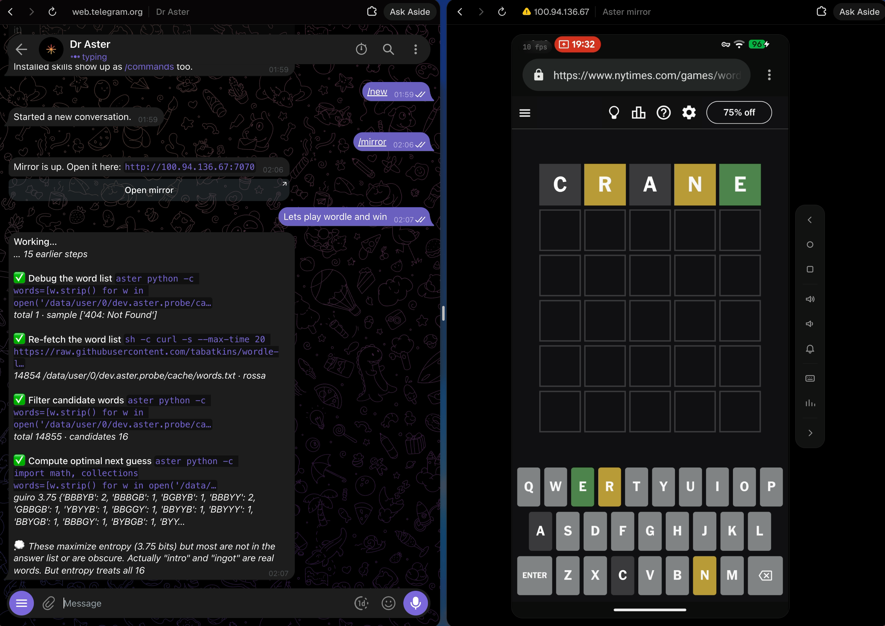

# asterdroid

Run Aster on an Android phone and control it through Telegram.



The app (`dev.aster.probe`) runs the full Aster agent on the phone. An accessibility service lets it read the screen, tap, swipe and type. You send instructions through Telegram and receive replies and screenshots.

`build-agent.sh` cross-compiles `aster-cli` for `aarch64-linux-android` and packages it as `libaster.so`. It uses the same tools, skills, prompts and review path as the terminal version.

**Status:** Used as a daily driver, still experimental. Builds require an Aster checkout, support only `arm64-v8a`, and require broad device permissions.

## Setup

Setup has two parts: [build and install the Android app](#build-and-install), then [connect your Telegram bot](#connect-your-telegram-bot). If the app is already installed and permissions are granted, go straight to the Telegram steps.

## Build and install

### What you need

- An Android 8+ phone or emulator (`minSdk 26`) connected through `adb`.
- An [Aster](https://github.com/zfinix/aster) checkout beside this repository, or `ASTER_REPO` pointing to one.
- `ANDROID_HOME` with build-tools and platform 35, an NDK, and `kotlinc`.
- A Rust toolchain that can build `std` for a custom target, with `rust-src` installed (`rustup component add rust-src`).
- Credentials for a supported model provider, or a local OpenAI-compatible endpoint.

### 1. Build the two binaries

```sh
./build-agent.sh     # the agent, into app/src/main/jniLibs/arm64-v8a/libaster.so
./build-client.sh    # asterctl and the mirror, as libclient.so
```

The first build takes longer: it builds `std` from source and a static `libffi`
for the embedded Python. Both land in `jniLibs` because `nativeLibraryDir` is
the executable location used by this app.

### 2. Build and install the app

```sh
./gradlew assembleDebug
adb install -r app/build/outputs/apk/debug/app-debug.apk
```

Gradle's `syncDocs` task copies `device-AGENTS.md` and every `skills/*/SKILL.md` into the APK's assets.

### 3. Grant permissions

```sh
./grant.sh
```

The script grants runtime permissions, app-op access, notification access, Do Not Disturb access and battery exemptions. It also enables and selects the keyboard and enables the accessibility service, then reports any denied grants.

Check that the accessibility service is enabled. The agent needs it to read and control the screen.

## Connect your Telegram bot

### 1. Create a bot with BotFather

Open [@BotFather](https://t.me/BotFather) in Telegram and send `/newbot`. Follow the prompts to name your bot and choose its username. BotFather returns a bot token. Copy it and keep the link to your new bot handy. See [Telegram's bot setup guide](https://core.telegram.org/bots/tutorial#obtain-your-bot-token) for details.

### 2. Add the token to asterdroid

On the Android phone, open asterdroid and tap the settings icon in the top right.

- Paste the full bot token into **Telegram token**.
- Select your model provider and enter its API key, such as `OPENROUTER_API_KEY`.
- Leave **Allowed ids** empty for now. The next step gets your numeric Telegram user ID.

Save the settings. Changes are written to the agent's `.env`; saving a key restarts the agent.

### 3. Start the agent and message your bot

Press the start control on asterdroid's home screen. Wait for the notification to say **Connected to Telegram**.

In Telegram, open the bot you just created and send `hello`. Send this to your own bot, not BotFather.

With no allowed users configured, it replies:

```txt
This bot isn't set up yet. Your user id is 8675309. Restart it with --user 8675309 to allow it.
```

Copy the user ID from your reply. The number above is an example.

### 4. Allow your Telegram account

Return to asterdroid's settings, paste that numeric ID into **Allowed ids**, and save. Use your user ID here, not your Telegram username or bot token. To allow multiple accounts, separate their IDs with commas.

The reply mentions `--user`, but on Android you configure this through **Allowed ids**. Once configured, the bot ignores accounts outside that list.

### 5. Send a test instruction

Return to your bot's Telegram chat and send:

```txt
Open settings and turn on Do Not Disturb.
```

The agent should respond and carry out the action on the Android phone. Use `/help` for chat commands, or `/mirror` to view the phone in a browser.

If the bot does not reply, check that asterdroid says **Connected to Telegram**, that you opened the bot whose token you entered, and that **Allowed ids** contains the ID from your own reply.

### Optional: configure from your computer

You can push a `.env` instead of entering values in the app. Replace the placeholders with your bot token, provider key and numeric Telegram user ID:

```sh
cat > .env <<'EOF'
ASTER_TELEGRAM_TOKEN=YOUR_BOT_TOKEN
OPENROUTER_API_KEY=YOUR_PROVIDER_KEY
ASTER_REMOTE_USERS=YOUR_TELEGRAM_USER_ID
EOF
adb push .env /sdcard/Android/data/dev.aster.probe/files/.env
```

The pushed values are merged with the phone's existing configuration. If you do not know your user ID yet, use steps 3 and 4 above to obtain and allow it.

## Using it from the chat

Send instructions in plain language. The agent reads the screen, performs actions and can send screenshots of the result.

```txt
you    open whatsapp and tell mum I land at 6
you    what did I miss on twitter
you    install duolingo and do today's lesson
you    turn on do not disturb until 7am
you    lets play wordle and win
```

Use `/help` to see the available commands:

| command | what it does |
| --- | --- |
| `/new` (or `/clear`) | start a fresh conversation |
| `/stop`, `/retry`, `/queue` | cancel the running turn, rerun the last message, see what is waiting |
| `/mirror`, `/mirror off` | share this phone's screen in a browser |
| `/mode`, `/model`, `/effort` | set mode, model and reasoning effort |
| `/status`, `/sessions`, `/resume` | view status, list sessions and resume a conversation |
| `/memory`, `/remember <fact>` | view or add persistent memory |
| `/skills`, `/learn` | browse skills or create one from the last turn |
| `/checkins`, `/cron` | manage check-ins and scheduled runs |

`/mirror` returns a browser URL for viewing and controlling the phone. It uses the phone's Tailscale address when available, otherwise its LAN address. The accessibility service handles the screen-capture dialog.

The app starts the agent in `yolo` mode because the phone has no terminal for approval prompts. Its instructions tell it to announce actions that send information outside the phone, then proceed. This is a notification, not an approval step. Use `/mode` to change the mode for a chat.

The app shows agent status, special permission grants, tool activity, transcripts, skills and memory. Provider, model and effort pickers restart the agent when changed.

## Configuration

The agent uses these environment variables:

| variable | set by | what it is |
| --- | --- | --- |
| `ASTER_TELEGRAM_TOKEN` | the settings sheet, or a pushed `.env` | the bot token; without it the bridge exits |
| `ASTER_REMOTE_USERS` | the settings sheet, or a pushed `.env` | comma-separated Telegram ids allowed to drive it |
| `<PROVIDER>_API_KEY` | the settings sheet, or a pushed `.env` | whichever key the chosen provider wants |
| `ASTER_BASE_URL`, `ASTER_MODEL`, `ASTER_EFFORT` | the app's pickers | the provider, model and effort for the next start |
| `ASTER_COMPACT_BUDGET` | the service (60000) | limits context growth from repeated screen maps |
| `HOME`, `TMPDIR`, `PATH` | the service | the app's private files, its cache, and `files/bin` |

The settings sheet and pushed files update the same `files/.env`. Each update preserves unrelated keys. Imports overwrite only the names present in the pushed file.

`dotenvy` preserves variables already set in the process environment, so the app's provider and model selections take precedence over `.env`.

The provider catalog is synced from Aster's `providers.json` at build time, with the copy under `assets/` as a fallback. Model lists come from the selected provider's `/models` endpoint.

## Troubleshooting

| symptom | what it is | what to do |
| --- | --- | --- |
| the notification never says "Connected" | no token, or no network | check `.env` landed (debug builds): `adb shell run-as dev.aster.probe cat files/.env` |
| the bot answers strangers with an id | no allowed ids yet | paste the id it printed into Allowed ids under the settings icon |
| "This build has no agent" | `libaster.so` is missing from the APK | rerun `./build-agent.sh`, rebuild, reinstall |
| every verb says it cannot reach the service | the accessibility service is off | rerun `./grant.sh`, or turn Aster on in Accessibility settings |
| `type` reports posted and nothing arrives | the field owns its own input (a terminal) | read the screen after typing; there is no way around it from here |
| `serve is not a verb` | a stale `asterctl` | `./build-client.sh`, reinstall, then open the app once so the bin symlinks refresh |
| `/mirror` says the port is held | something else is listening on 7070 | stop it; the mirror will not kill a process it does not own |
| the viewer says capture was not allowed | a PIN or pattern keyguard | unlock the phone once; that is a lock that requires manual input |
| nothing works after a reboot | the agent is not started at boot yet | open the app once |
| the agent tapped nothing and said the screen is locked | the keyguard is up | taps do not reach apps behind it; unlock first |

Logs are under the `ASTEREYES`, `ASTERAGENT`, `ASTERPROBE`, `ASTERINSTALL`,
`ASTERWAKE` and `aster-mirror` tags.

## Architecture

The foreground service runs `aster remote telegram` as a child process. The agent calls `asterctl`, which sends commands to `AsterA11yService` over an abstract Unix socket. The service reads accessibility trees, dispatches gestures and captures screenshots. `asterctl serve` provides the browser mirror.

| Component | Role |
| --- | --- |
| `libaster.so` | Full Aster agent, supervised by `AsterAgentService` |
| `asterctl` (`libclient.so`) | Command client and mirror server |
| `AsterA11yService` | Screen reads, gestures, OCR and command handling |
| `AsterIme` | Text input for fields that reject `ACTION_SET_TEXT` |
| `device-AGENTS.md` and `skills/` | Device instructions and task-specific guidance |

The service restarts the agent with backoff from 5 seconds to 5 minutes. Backoff increases when the process fails within a minute.

`Install.kt` refreshes binaries, skills and instructions on every service start. It also recreates `aster` and `asterctl` symlinks in the app's private `bin` directory, pointing to executables in `nativeLibraryDir`. This preserves the executable targets' SELinux labels and updates the paths after reinstalls.

## Control protocol

Commands use the abstract socket `@aster-eyes`: one line per connection, with the response read to EOF. The service retries binding ten times at 300 ms intervals, waits two seconds, then repeats if the previous listener still holds the socket.

The accept loop handles three request types:

- `stream …` turns the connection into a video stream.
- `live …` handles mirror input on a separate thread so it does not wait behind agent commands.
- Other commands wake the display, run the action and return a receipt with the updated screen state.

Display wake uses `SCREEN_BRIGHT_WAKE_LOCK` with `ACQUIRE_CAUSES_WAKEUP`, held for two minutes. The service polls for an active window every 50 ms for up to three seconds. Responses identify an active keyguard because taps cannot reach apps behind it.

### Targets

Commands accept the following target formats:

| target | comes from | example |
| --- | --- | --- |
| element index | `map` or `find` | `tap 11` |
| pixel pair | anywhere | `tap 540,1200` |
| grid cell | `shot grid` | `tap F7` |
| OCR block | `ocr` | `tap o3` |
| blob | `locate` | `drag b0 b3` |
| rectangle | a map's bounds | `shot 0,452-1080,683` |

Stale handles return a message identifying the read to repeat, for example: `no ocr block o4; the last ocr had 3; run ocr again`.

## Command reference

Run `asterctl help` on the device for the command list.

### Read

| verb | what it does |
| --- | --- |
| `map` (alias `screen`) | numbered, actionable elements; the index is the handle |
| `find <text>` | the same list, filtered by text, content-desc or id |
| `ocr` | read text the tree cannot see (canvas, game, image) |
| `notes` | notifications seen since the last read, newest first |
| `apps [filter]` | installed apps, label first |
| `shot [target]` | PNG of the screen, an element, a rectangle or a cell |
| `shot grid [px]` | PNG with lettered cells; `shot grid <cell\|range>` zooms, pixel-labelled |
| `shot jpeg <1-100> <width>` | the same capture scaled, with the real screen size alongside |
| `marks [off]` | draw the map's indices over the live screen |
| `events` | which packages are keeping the screen busy, over one settle budget |

### Gestures

| verb | what it does |
| --- | --- |
| `tap <target>` | click; resolves up to the row that owns a label |
| `press <target>` | long press (600 ms): opens context menus |
| `swipe <from> <to> [ms]` | a flick (300 ms): scrolls, dismisses, archives |
| `drag <p1> <p2> [p3 …] [ms]` | down, pause, move, pause, up (alias `slide`) |
| `hold <target> <ms>` | hold a touch for the specified duration |
| `pinch <target> in\|out [ms]` | two fingers: maps, photos |
| `finger down\|move\|up` | one touch held across calls, with reads in between |
| `live tap\|press\|down\|move\|up\|key` | mirror input without settling |
| `scroll [n] up\|down` | scroll an element, or the biggest scroller on screen |

### Text input

| verb | what it does |
| --- | --- |
| `text <text>` | set the focused field outright through `ACTION_SET_TEXT` |
| `type <text>` | commit through the keyboard, append through the input connection |
| `clear` | empty the focused field, either side of the cursor |
| `key <name>` | `back`, `home`, `recents`, `lock`, `power`, `notifications`, `quicksettings`, and `enter`, `delete`, `tab` into the focused field |

### Waiting and scheduling

| verb | what it does |
| --- | --- |
| `wait <text> [secs]` | block until the text is on screen (default 10 s, capped at 20 s) |
| `later <30s\|2m\|1h\|18:30> <what to do>` | end the turn; a reminder wakes the agent then |

### App and system shortcuts

| verb | what it does |
| --- | --- |
| `open <app>` | launch by label or package, then map the new screen |
| `restart <app>` | home, kill the background process, reopen |
| `install <app>` | the store page for it, then map it |
| `settings [name]` | `wifi bluetooth airplane data sound display battery apps location storage`, or bare |
| `quicksettings`, `notifications` | the shades, through global actions |
| `dial`, `sms`, `url` (alias `web`), `search`, `place` | hand off to whatever app owns the scheme |
| `alarm HH:MM`, `timer 10m`, `event HH:MM` | the phone's own clock and calendar |
| `wallpaper <path>` | from an image on disk, scaled and cropped without a picker |
| `emergency <number>` | dial, then press the dialer's own call button |
| `volume up\|down\|max\|mute\|<0-100> [stream]` | `media ring alarm notification call` |
| `media pause\|play\|toggle\|next\|prev` | to whichever app holds the media session |

`emergency` opens the dialer with the number and presses its call button, found by view ID. This avoids loose text matches against other clickable dialer elements.

`alarm` and `timer` use the phone's clock app, so they do not depend on the agent process staying alive.

`later` schedules an exact alarm. Its receiver writes a file that the Telegram bridge turns into a new agent turn. This lets the current turn finish while waiting for a longer task.

## Action receipts

Every action returns a dispatch receipt followed by observed screen changes:

```txt
receipt: posted ("System" via its row)
changed: +32 -30 pkg=com.android.settings after_ms=713
```

`posted` means the event was accepted. The `changed` line compares element signatures before and after the action: class, ID, text, description and top-left position. A screen change does not by itself confirm that the intended task succeeded.

An empty diff returns:

```txt
warning: nothing on screen changed; treat as not done
```

`quiesce` waits up to 1500 ms for an accessibility event, then waits for 150 ms of quiet within a 600 ms budget. Waiting for the first event prevents a read from returning before the app reacts. The budget prevents animations from blocking indefinitely.

For screens with no useful accessibility tree, the service compares 152 px-wide thumbnails using an RGB delta threshold, groups changes into rectangles and runs OCR:

```txt
changed: tree blind (0 elements); 6% of pixels changed since the frame 2s before the action
moved: 84,1204-996,1560; 12,96-1068,240
```

`settleBlind` samples thumbnails every 120 ms until consecutive frames differ by no more than 1% for 280 ms, within the same settling budget.

## Reading the screen

`capture()` walks accessibility windows and returns numbered elements:

- Skip non-application windows measuring 200 px or less in either dimension, such as system bars and floating controls.
- Keep visible nodes with valid bounds that are interactive or contain text or a content description. Skip layout-only nodes but continue through their children.
- Stop at 4000 nodes. On API 33+, use descendant and sibling prefetching to reduce cross-process reads.
- Limit each output line to 160 characters so large content descriptions do not overwhelm the response.

Example:

```txt
pkg=com.android.settings elements=33 capture_ms=8.1
 11 [LinearLayout] 0,452-1080,683 tap
 12 [TextView] #title "Location" 189,506-394,577
```

`pkg` identifies the foreground app. Rows use `index [Class] #id "text" left,top-right,bottom`, followed by flags such as `tap`, `edit` or `scroll`.

When tapping a label, the service searches up to six ancestors for a visible, clickable parent and identifies it in the receipt.

`wait <text>` polls `find` every 500 ms. When the tree has no useful elements, it uses OCR once per second. On timeout, it returns close matches and the current map to help identify the next action.

## Gestures

`tap` uses `ACTION_CLICK` when supported, otherwise a gesture at the target's centre. Gesture cancellation is reported to the caller.

- `swipe` uses a single 300 ms stroke for scrolling and flings.
- `drag` continues one touch through a press, pause, movement, pause and release. The pauses help sliders and draggable items register the grab and drop.
- `pinch` dispatches two strokes, ranging from 80 px to 400 px on either side of the centre.
- `finger down|move|up` holds a touch across calls, allowing screen reads and adjustments before release.
- `live` handles mirror input using 16 ms segments, with moves capped at 250 ms and no screen read or settling wait. A new `down` releases any touch left active by a disconnected viewer.

`key lock` locks the device through accessibility. It returns the keyguard state instead of a screen diff.

## Typing

`text` replaces the focused field through `ACTION_SET_TEXT`. Some Compose editors, WebViews and custom fields reject it.

`type` commits text through `AsterIme` and the focused field's `InputConnection`. The IME draws no window, keeping the screen available for taps and accessibility reads.

Neither method reaches a view that handles input without opening an input connection. In those cases, including some terminals, `type` may report `posted` without inserting text. Read the field after typing to verify the result.

## Visual targeting

When accessibility does not expose useful elements, the agent can use OCR, a screenshot grid or colour-based targets.

| Tool | Behaviour |
| --- | --- |
| `ocr` | Runs ML Kit's Latin recogniser on a screenshot and returns numbered text blocks with bounds. `tap o4` targets block 4. |
| `shot grid` | Adds labelled cells to a screenshot, with ten cells across the short side. Gestures target cell centres. |
| `shot grid R3` or `shot grid Q2-S4` | Crops and enlarges a cell or range, with screen-pixel labels for more precise targeting. |
| `locate bright` or a colour name | Finds connected regions on a 900 px-wide working image and returns `b0`, `b1`, etc., largest first, with centre coordinates. |
| `aim <target>` | Adjusts a pool cue using repeated screenshot measurements, up to six iterations or two degrees of error. |

The grid is added only to the returned image, so it does not affect OCR or the live screen. Cell coordinates depend on screen size.

`aim` finds the cue ball's solid core by eroding a white-pixel mask, estimates the aim line from distant bright pixels, then adjusts the drag using a secant update.

`Vision.kt` implements these operations as screenshot functions. Working images are downscaled; returned coordinates are converted back to device pixels.

## Screen mirror

`/mirror` starts `asterctl serve` and returns a browser URL. `/mirror off` stops it. The page at `/` displays the phone and accepts input; `/ws` carries H.264 video out and touch, key, text and quality messages in.

MediaProjection sends a VirtualDisplay directly to a hardware `MediaCodec` input Surface. The encoder is configured for 1080 px width, 60 fps, variable bitrate and ten-second keyframe intervals. `KEY_LATENCY` is set to 1, and the previous frame repeats every 100 ms to support viewers joining a static screen.

One capture serves all viewers and remains active for 30 minutes after the last viewer leaves. Quality presets change bitrate without resizing or requesting a new projection.

Each viewer has its own writer thread and a 60-frame queue. When a queue overflows, its backlog is dropped and playback resumes at the next keyframe. A viewer is disconnected after five overflows, keeping slow connections from blocking the encoder.

The capture protocol follows scrcpy: eight bytes of presentation timestamp and flags, four bytes of payload length, then Annex-B data. The Rust server converts the video to AVCC for WebCodecs and derives the codec string from the SPS.

`MirrorAutoAccept` uses accessibility view IDs to select whole-screen capture and accept the system dialog. Capture consent must be granted before starting the `mediaProjection` foreground service.

Joining wakes the screen, attempts to dismiss the keyguard and holds a wake lock while viewers are connected. A PIN or pattern requires manual unlocking. Locking the device stops the projection.

To change the viewer without reinstalling, place a copy at `files/viewer.html` or set `ASTER_MIRROR_UI`. See `skills/mirror/SKILL.md` for packet formats, quality settings and Tailscale or cloudflared setup.

## Android cross-build

The embedded Python interpreter requires more thread-local storage than the stock Rust Android target can provide through bionic's 128 pthread keys. Without the custom target, startup can abort with `out of TLS keys`.

`target-spec/aarch64-linux-android.json` enables LLVM's emulated TLS lowering:

```json
"tls-model": "emulated",
"has-thread-local": true
```

This routes thread-local storage through a single pthread key. The build explicitly links the NDK's compiler-rt archive for `__emutls_get_address`.

RustPython's `ctypes` also needs `libffi`, which Android does not provide. `build-agent.sh` builds and statically links it. The build sets `RUSTC_BOOTSTRAP=1` for `build-std` and the JSON target spec, and requires `rust-src`.

The control client uses the standard Android target without the custom spec.

## Driving it from a host

Use `run-as` to call the client from a host with a debug build. During normal operation, the agent runs `asterctl` directly as a child process.

```sh
adb shell run-as dev.aster.probe files/bin/asterctl map
```

For release builds, send commands through a broadcast and read the response from the external files directory:

```sh
adb shell am broadcast -p dev.aster.probe --receiver-foreground -a dev.aster.probe.CTL --es cmd "'shot grid'"
adb shell cat /sdcard/Android/data/dev.aster.probe/files/ctl/reply.txt
adb pull /sdcard/Android/data/dev.aster.probe/files/ctl/shot.png
```

The inner quotes matter: `adb shell` strips the outer pair, so without them the
phone sees `shot` and `grid` as two arguments. `-p` matters too, or the broadcast
is deferred while the app is in the background.

Other broadcasts: `CAP` logs a map, `BENCH --ei n 20` reruns the capture
benchmark, `EXPORT` copies skills, memory and sessions out for `adb pull`,
`IMPORT` replaces them from a pushed directory, and `CLEAR_FEED` empties the live
feed.

To reach the mirror from the host without Telegram:

```sh
adb shell "asterctl serve >/dev/null 2>&1 &"   # it blocks otherwise
adb forward tcp:7071 tcp:7070                  # then open http://localhost:7071
```

## Permissions

The app requests broad device permissions. Runtime permissions are requested at launch, with foreground permissions before background location. Other grants require `grant.sh` or a Settings toggle.

The accessibility service requests interactive windows, view IDs, not-important views, key-event filtering and screenshots. It declares `isAccessibilityTool` and sets `notificationTimeout` to 0 to avoid event coalescing.

Touch exploration is disabled because it changes normal tap behaviour and interferes with manual use.

## What the probe established

Measured on a Pixel 7 emulator running Android 15 / API 35 with a software GPU. These results describe that test environment.

| question | answer |
| --- | --- |
| Can a normal app exec the agent? | yes, from `nativeLibraryDir`, `aster 0.5.0`, exit 0 |
| Can it read another app's screen? | yes, 164 nodes walked to 35 kept, 2.3 KB |
| Can it act, and does the act land? | yes, confirmed by the foreground activity changing |
| How fast, screen already still? | **~8 ms** end to end from the Rust side |
| How fast during a fling? | p50 21 ms, p95 84 ms |
| How fast across an app launch? | 100-600 ms, sometimes worse |
| Same read over `adb uiautomator dump` | **2470 ms**, 27851 bytes |

## Implementation notes

- Wait for the screen to settle before reading. Mid-animation reads were about 40 times slower in the probe.
- Wait for an action event before waiting for quiet. Otherwise the service can read the old screen before the app reacts.
- Keep process execution and blocking client calls off the main thread. The socket handler posts capture work to that thread, so blocking it causes a deadlock.

## Known limits

- Text input fails in views that do not expose an input connection or accept `ACTION_SET_TEXT`.
- Canvas interfaces may expose no useful accessibility elements. OCR and visual targeting can help, but results need verification.
- Apps behind a PIN or pattern lock require manual unlocking.
- The agent does not start automatically after a reboot. Open the app once to start it; `RECEIVE_BOOT_COMPLETED` is declared but not used.
- Only `arm64-v8a` is built and shipped.
- Performance figures come from an emulator. Real-device performance has not been established by these measurements.

## Repository layout

```
app/src/main/
  AndroidManifest.xml            permissions, services and receivers
  assets/                        AGENTS.md, the flattened skills, providers.json (generated)
  jniLibs/arm64-v8a/             libaster.so (the agent), libclient.so (asterctl)
  kotlin/dev/aster/probe/
    AsterA11yService.kt          capture, gestures, OCR, the socket, the verbs
    AsterAgentService.kt         the supervised agent process
    AsterIme.kt                  the invisible keyboard
    AsterNotifications.kt        the notification listener
    Mirror*.kt                   MediaProjection, the encoder, consent, viewers
    Grid.kt, Vision.kt           lettered cells, blobs, changed regions, the aim read
    MarksOverlay.kt              the map's indices drawn on the live screen
    Shortcuts.kt                 apps, settings, intents, alarms, the store
    Install.kt                   bins, skills, instructions and .env on every start
    Env.kt                       the .env, read and written from the phone
    Models.kt                    the provider catalog, model lists, the child's env
    Sessions.kt, Feed.kt         transcripts and the live feed
    WakeReceiver.kt              `later`, as an alarm and a wakeup file
    MainActivity.kt, ui/         the app
  res/xml/a11y_config.xml        what the accessibility service may do
client/
  src/main.rs                    the CLI, and serve's detached re-exec
  src/socket.rs                  the abstract socket, one line in
  src/server.rs                  the mirror: axum, the websocket, Annex-B to AVCC
  viewer.html                    the mirror page, served from the binary
skills/<name>/SKILL.md           task instructions, shipped into assets
device-AGENTS.md                 device instructions, shipped as AGENTS.md
docs/ANDROID.md                  the longer architecture write-up
target-spec/                     the custom Android target that turns TLS on
build-agent.sh, build-client.sh  the two cross-builds
grant.sh                         every permission and toggle, over adb
```
