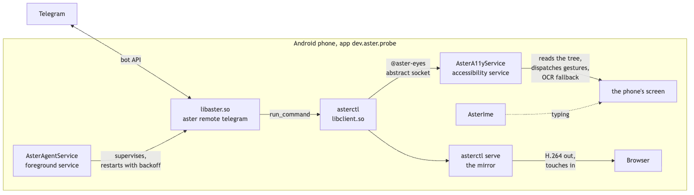

# asterdroid

Run Aster on an Android phone and control it through Telegram.


The app (`dev.aster.probe`) runs the full Aster agent on the phone. An accessibility service lets it read the screen, tap, swipe and type. You send instructions through Telegram and receive replies and screenshots.

`build-agent.sh` cross-compiles `aster-cli` for `aarch64-linux-android` and packages it as `libaster.so`. It uses the same tools, skills, prompts and review path as the terminal version.

**Status:** Used as a daily driver, still experimental. Builds require an Aster checkout, support only `arm64-v8a`, and require broad device permissions.

## Quick start

Four steps, no compiler.

1. Install the latest APK from [Releases](https://github.com/Zfinix/asterdroid/releases) and open it. Grant what it asks for: accessibility, notification access, Do Not Disturb.
2. Create a Telegram bot with [@BotFather](https://t.me/BotFather) and copy the token.
3. In the app's settings: paste the token, pick the provider, paste its key. Save. ([Providers](docs/PROVIDERS.md) has the full list and key pages; Groq has a free tier, a local server needs no key.)
4. Press start, wait for **Connected to Telegram**, send `hello` to your bot. It replies with your numeric user id. Paste that id into **Allowed ids**, save, then send a real instruction:

```txt
Open settings and turn on Do Not Disturb.
```

## Documentation

| doc | what is in it |
| --- | --- |
| [docs/SETUP.md](docs/SETUP.md) | Telegram bot setup in detail, pushed `.env`, configuration variables, troubleshooting |
| [docs/PROVIDERS.md](docs/PROVIDERS.md) | all 40 providers with key pages and env variables |
| [docs/USING.md](docs/USING.md) | chat commands, the control protocol, action receipts, the screen mirror |
| [docs/ARCHITECTURE.md](docs/ARCHITECTURE.md) | how it works, with a diagram |
| [docs/BUILDING.md](docs/BUILDING.md) | build from source, releases, CI, permissions, repository layout |

## The short version of how it works

A foreground service runs `aster remote telegram` as a child process. The agent calls `asterctl`, which talks to `AsterA11yService` over an abstract Unix socket; the service reads accessibility trees, dispatches gestures and captures screenshots. Full detail in [docs/ARCHITECTURE.md](docs/ARCHITECTURE.md).


