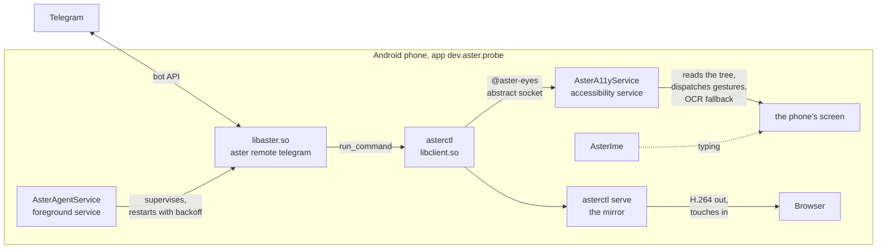

# asterdroid architecture

## What this is

asterdroid runs the real Aster agent on an Android phone. The app is `dev.aster.probe`. It reads the screen through an accessibility service, touches it the way a thumb does, and answers over Telegram. The person holding the conversation is usually nowhere near the phone.

It is not a port and not a subset. `build-agent.sh` cross-compiles `aster-cli` for `aarch64-linux-android` and ships it inside the APK as `libaster.so`. The tools, skills, prompts and review path are the code that runs in a terminal. It started as a measuring rig for the questions `docs/COMPUTER-USE.md` leaves open on Android, and it is now the daily-driver way to run Aster on a phone.

The hard part is not the model. A phone has no shell, so the screen is the only interface, and an agent that cannot prove an action landed is just guessing.

## The shape of it



One process tree on the phone:

- **Telegram** is the interface. The agent runs `remote telegram` as a child of `AsterAgentService`, in `yolo` mode, because there is no terminal on the phone to answer a permission prompt. Consent lives in the chat: before anything that leaves the device, the agent states the concrete effect in one line and then does it.
- **libaster.so** is the agent. It calls `asterctl` through `run_command`, the same way it calls anything else.
- **asterctl** is the agent's body, a small Rust client. It speaks to the accessibility service over an abstract unix socket named `@aster-eyes`. Abstract means there is no file on disk and no permissions to get wrong. Connecting costs about 150 microseconds, which is why paying it per verb is fine.
- **AsterA11yService** does the touching. It reads the pruned node tree, dispatches gestures, and falls back to OCR where the tree is blind.

The agent is exec'd from `nativeLibraryDir`, the one place Android will execute a file from. `Install.kt` symlinks `asterctl` and `aster` into the app's private `bin` directory on every service start, because the agent calls both by name. A symlink keeps the SELinux label of its target, which is why that works and a copy into the data directory would not be executable at all. Every install lands in a new `nativeLibraryDir`, so the links are deleted and remade each time rather than trusted.

| Component | Role |
| --- | --- |
| `libaster.so` | Full Aster agent, supervised by `AsterAgentService` |
| `asterctl` (`libclient.so`) | Command client and mirror server |
| `AsterA11yService` | Screen reads, gestures, OCR and command handling |
| `AsterIme` | Text input for fields that reject `ACTION_SET_TEXT` |
| `device-AGENTS.md` and `skills/` | Device instructions and task-specific guidance |

The service restarts the agent with backoff from 5 seconds to 5 minutes. Backoff increases when the process fails within a minute.

`Install.kt` refreshes binaries, skills and instructions on every service start. It also recreates `aster` and `asterctl` symlinks in the app's private `bin` directory, pointing to executables in `nativeLibraryDir`. This preserves the executable targets' SELinux labels and updates the paths after reinstalls.

## The cross-build

Rust's stock Android target keeps native thread-local storage off. That sounds harmless until you embed a Python interpreter, which Aster does for its `python` tool: every thread-local then costs one of bionic's 128 pthread keys, and the interpreter aborts with `out of TLS keys`.

The fix is a custom target spec, `target-spec/aarch64-linux-android.json`, whose whole reason for existing is two lines:

```json
"tls-model": "emulated",
"has-thread-local": true
```

With native TLS on, LLVM lowers thread-locals to emulated TLS on Android, which routes every one of them through a single key. That lowering calls `__emutls_get_address`, which lives in the NDK's compiler-rt archive, and rustc's default link drops it. So the build passes the archive explicitly:

```sh
RT="$(ls "$NDK"/toolchains/llvm/prebuilt/"$HOST"/lib/clang/*/lib/linux/libclang_rt.builtins-aarch64-android.a | head -1)"
export CARGO_TARGET_AARCH64_LINUX_ANDROID_RUSTFLAGS="-C link-arg=$RT -L $FFI_DIR/lib"
```

`libffi` is the other one. RustPython's `ctypes` wants a system `libffi`, which Android does not ship, so the script builds a static one once from source into `target/android-tls/libffi` and links against it.

Because `build-std` and JSON target specs are still nightly features, the build sets `RUSTC_BOOTSTRAP=1` and needs `rust-src` installed (`rustup component add rust-src`). The invocation:

```sh
cargo build --release -p aster-cli --bin aster \
  -Zbuild-std=std,panic_abort -Zjson-target-spec \
  --target target-spec/aarch64-linux-android.json \
  --target-dir ../../target/android-tls --manifest-path ../../Cargo.toml
```

The output is copied to `app/src/main/jniLibs/arm64-v8a/libaster.so`. It has to be a `.so` in that directory, because `nativeLibraryDir` is the one place Android will execute a file from. The control client is built the same way but with plain std, no target spec, and lands as `libclient.so`.

`build-agent.sh` expects an aster checkout beside this repo; `ASTER_REPO` points it somewhere else.

## The protocol

One line in, text out, over `@aster-eyes` in the abstract namespace. The socket lives in the abstract namespace rather than the filesystem so there is no path to protect and no permissions to get wrong. The service binds it with ten retries at 300 ms apart, then waits two seconds and loops, because a previous listener unwinding can take longer than any fixed number of tries and giving up used to leave the service bound and answering nothing.

The verbs are the agent's whole vocabulary on the device; the full list is in [USING.md](USING.md).

The target grammar is uniform across all of them: an element index from `map`, a pixel pair, a grid cell like `F7`, an OCR block like `o3`, or a blob from `locate`. That is what lets the agent fall back from the tree to the grid to OCR without learning a new syntax each time.

There is also a set of verbs that skip the screen entirely, because reading and tapping your way across the phone works and is slow. Where an intent exists, it is one call instead of a dozen reads that can each go wrong: `open`, `settings`, `quicksettings`, `notifications`, `dial`, `sms`, `url`, `alarm`, `timer`, `event`, `media`, `volume`, `wallpaper`, `emergency`.

And a set that skips the tree entirely, for the screens the tree cannot describe. `locate bright` finds numbered blobs by true centre, `aim` points a cue at a target and self-corrects, `shot grid` lays lettered cells over the screen so a tap can name a cell instead of a pixel, and `marks` draws the map's own indices over the live screen. On a canvas app, where the whole map is one element with nothing inside, those are the only handles there are.

## The receipt model

Every action returns two lines. The first is the receipt, the acknowledgement that the event was accepted. The second is what actually changed.

```text
receipt: posted ("System" via its row)
changed: +32 -30 pkg=com.android.settings after_ms=713
```

That second line is the whole design. A receipt only means the system took the event. The diff is the evidence, and an empty diff prints a warning instead of a success:

```text
warning: nothing on screen changed; treat as not done
```

On a blind tree the diff is pixels instead. A canvas app exposes the whole map as one element with nothing inside, so the service keeps a small thumbnail of the frame before the action, compares it after, and then reads the result with OCR:

```text
changed: tree blind (0 elements); 6% of pixels changed since the frame 2s before the action
```

The comparison is a downscaled thumbnail and a per-pixel RGB delta threshold, so it is cheap enough to run after every action. `wait <text>` reads by OCR on a blind tree too, because a blind screen has no accessibility events and waiting for them never returns.

Three rules keep the verifier honest, and each one came from watching the agent get something wrong:

- **Read when the screen is still.** Reading mid-animation costs about forty times as much and returns a frame nobody asked for. Events mark the screen dirty, and a read waits for quiet before it captures.
- **Wait for the action to land before waiting for quiet.** Waiting only for quiet returns instantly when the app has not reacted yet, reads the stale tree, and reports a real navigation as no change. A verifier that lies is worse than no verifier at all.
- **Never exec the agent on the main thread.** The activity blocked on the client while the socket handler posted its capture to the same looper. Same process, same thread, instant deadlock.

## What the probe established

Measured on a Pixel 7 emulator running Android 15 / API 35 with a software GPU. These results describe that test environment.

| question | answer |
| --- | --- |
| Can a normal app exec the agent? | yes, from `nativeLibraryDir`, `aster 0.5.0`, exit 0 |
| Can it read another app's screen? | yes, 164 nodes walked to 35 kept, 2.3 KB |
| Can it act, and does the act land? | yes, confirmed by the foreground activity changing |
| How fast, screen already still? | **~8 ms** end to end from the Rust side |
| How fast during a fling? | p50 21 ms, p95 84 ms |
| How fast across an app launch? | 100-600 ms, sometimes worse |
| Same read over `adb uiautomator dump` | **2470 ms**, 27851 bytes |

## Known limits

- Text input fails in views that do not expose an input connection or accept `ACTION_SET_TEXT`.
- Canvas interfaces may expose no useful accessibility elements. OCR and visual targeting can help, but results need verification.
- Apps behind a PIN or pattern lock require manual unlocking.
- The agent does not start automatically after a reboot. Open the app once to start it; `RECEIVE_BOOT_COMPLETED` is declared but not used.
- Only `arm64-v8a` is built and shipped.
- Performance figures come from an emulator. Real-device performance has not been established by these measurements.